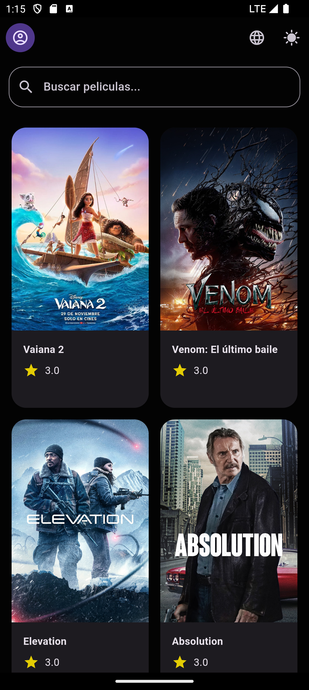
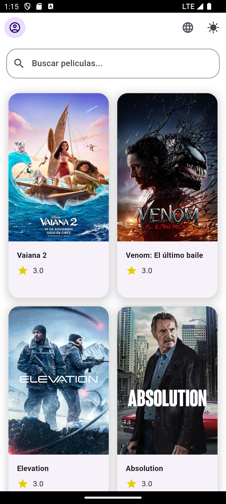

# kueski_mobile_code_challenge

A new Flutter project for the Kueski mobile code challenge.

## Getting Started

This project is a starting point for a Flutter application.

### Project Overview

This application is designed to demonstrate the use of various Flutter libraries and best practices in mobile development. It includes features such as localization, theme management, and integration with Firebase.

### Libraries Used

- **flutter_bloc**: For state management using the BLoC pattern.
- **flutter_secure_storage**: For securely storing sensitive data.
- **shared_preferences**: For storing simple key-value pairs.
- **dio**: For making HTTP requests.
- **cached_network_image**: For loading and caching network images.
- **lottie**: For displaying animations.
- **firebase_core**: For integrating Firebase into the application.
- **flutter_dotenv**: For loading environment variables from a `.env` file.

### How to Run the Project

1. **Clone the repository**:
   ```sh
   git clone https://github.com/yourusername/kueski_mobile_code_challenge.git
   cd kueski_mobile_code_challenge

### Screenshots




